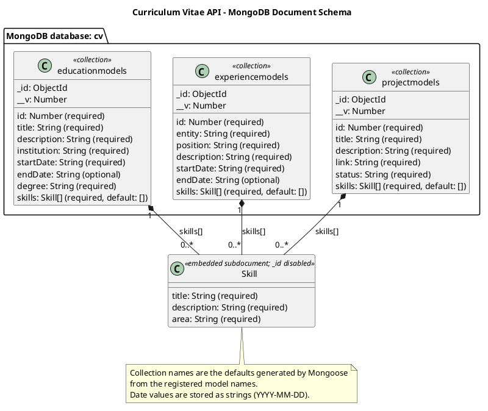
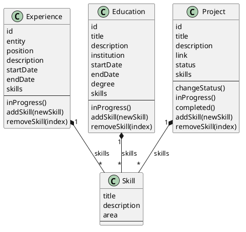

# Curriculum Vitae API

A REST API for managing professional experience, education, and projects. Built with Node.js, Express 5, MongoDB, and Mongoose.

[Project overview](../README.md) · [Class diagram source](documentation/classDiagram.puml) · [Document schema source](documentation/documentSchema.puml)

## Requirements

- Node.js and npm
- MongoDB running locally, or a MongoDB connection URI

## Install and run

Run these commands from the `backend/` directory:

```bash
npm install
npm run dev
```

The development server watches for file changes. For a regular start, use `npm start`.

By default, the API listens on port `3000` and connects to `mongodb://127.0.0.1:27017/cv`. Configure either value through environment variables:

```bash
PORT=4000 MONGODB_URI="mongodb://127.0.0.1:27017/cv" npm run dev
```

PowerShell:

```powershell
$env:PORT = "4000"
$env:MONGODB_URI = "mongodb://127.0.0.1:27017/cv"
npm run dev
```

The application reads these values from the process environment; it does not automatically load a `.env` file.

Check the health endpoint:

```bash
curl http://localhost:3000/health
```

```json
{"status":"OK"}
```

## API

All endpoints use JSON request and response bodies where applicable. The API has no version prefix.

| Resource | List | Get one | Create | Replace | Delete |
| --- | --- | --- | --- | --- | --- |
| Education | `GET /education` | `GET /education/:id` | `POST /education` | `PUT /education/:id` | `DELETE /education/:id` |
| Experience | `GET /experiences` | `GET /experiences/:id` | `POST /experiences` | `PUT /experiences/:id` | `DELETE /experiences/:id` |
| Projects | `GET /projects` | `GET /projects/:id` | `POST /projects` | `PUT /projects/:id` | `DELETE /projects/:id` |
| Health | `GET /health` | — | — | — | — |

Collection endpoints return lists. Creating a resource responds with `201` and its `id`. `PUT` replaces the full resource.

### Required fields

| Resource | Required fields |
| --- | --- |
| Education | `title`, `description`, `institution`, `startDate`, `degree`, `skills` |
| Experience | `entity`, `position`, `description`, `startDate`, `skills` |
| Project | `title`, `description`, `link`, `status`, `skills` |

Education and experience dates use `YYYY-MM-DD`; `endDate` is optional. Each `skills` item is an object containing `title`, `description`, and `area`.

Supported education degrees are `bachelor`, `associate`, `master`, and `doctoral`. Supported project statuses are `In Progress` and `Completed`.

Example project request:

```bash
curl -X POST http://localhost:3000/projects \
  -H 'Content-Type: application/json' \
  -d '{
    "title": "Portfolio API",
    "description": "An API for exploring and maintaining my professional journey.",
    "link": "https://example.com",
    "status": "In Progress",
    "skills": [
      {
        "title": "Node.js",
        "description": "Backend service development.",
        "area": "Backend"
      }
    ]
  }'
```

## Project structure

```text
src/
  config/        Database connection
  controllers/   HTTP request handling
  domain/        Domain entities
  errors/        Application errors
  middlewares/   Async and error handling
  persistence/   Mongoose models and schemas
  repositories/  Data access
  routers/       HTTP routes
  services/      Application logic
  utils/         Shared utilities
  validators/    Request validation
```

The application is assembled in `app.js`. `index.js` connects to MongoDB and starts the HTTP server.

## Data model diagrams

### MongoDB document schema



The three top-level collections contain education, experience, and project documents. Each document has MongoDB's `_id` and Mongoose's `__v`; the numeric `id` is an additional application field. Skills are embedded subdocuments with no `_id` of their own.

### Domain class diagram



## Tests

```bash
npm test
```

Integration tests exercise the HTTP routes with mocked repositories, so they do not require a live MongoDB connection.

## Security

The API does not implement authentication or authorization for write operations. It also enables CORS without an origin restriction. Add access controls and configure an explicit CORS policy before exposing it beyond a trusted environment.

## Available scripts

| Command | Description |
| --- | --- |
| `npm start` | Start the server |
| `npm run dev` | Start the server in watch mode |
| `npm test` | Run the test suite |
